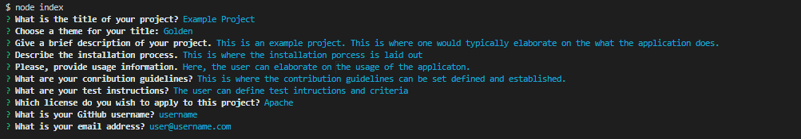

# Forge: A simple README generator

Forge is a small command-line application that allows for the quick generation of a README file. The generated file is compatible with GitHub Flavored Markdown.


## Table of Contents

* [Description](#description)
* [Installation](#installation)
* [Usage](#usage)
* [Screenshots](#screenshots)
* [Questions](#questions)


## Description

* Simple command-line application that can be run through [Node.js](https://nodejs.org/en/)
* Consists of an `index.js` file, a `package.json` file, and an empty folder named "generated", which will store the README file and the themed SVG file
* Utilizes  the [Inquirer package](https://www.npmjs.com/package/inquirer)


## Installation

* The Node.js runtime environment will need to be installed, first.
    * For more information, go to : [Node.js](https://nodejs.org/en/)
* Copy the files `index.js`, `package.json`, and  the "generated" folder to a locally stored folder
* Through a terminal, navigate to the location of the stored files
    * Install the required dependencies by running the following command in the Node runtime environment:
        ```
        npm i
        ```
* Once the dependencies are installed, run the `index.js` file
    * To run the file, use the following command:
        ```
        node index
        ```

## Usage

When the application is initiated, the user wiill be met with a series of questions. These questions will define the parameters of the README file.  Once the user has completed answering all of the questions, a `README.MD` file and a `title.svg` file will be placed in the "generated" folder.


## Screenshots

Example of questionnaire




Example of a completed README


## Questions

Feel free to get in touch with me if you have any questions or concerns.

Link to my GitHub Profile: [Bertodemus](https://github.com/bertodemus)

Email me at: [roberto@robertorubet.com](roberto@robertorubet.com)
